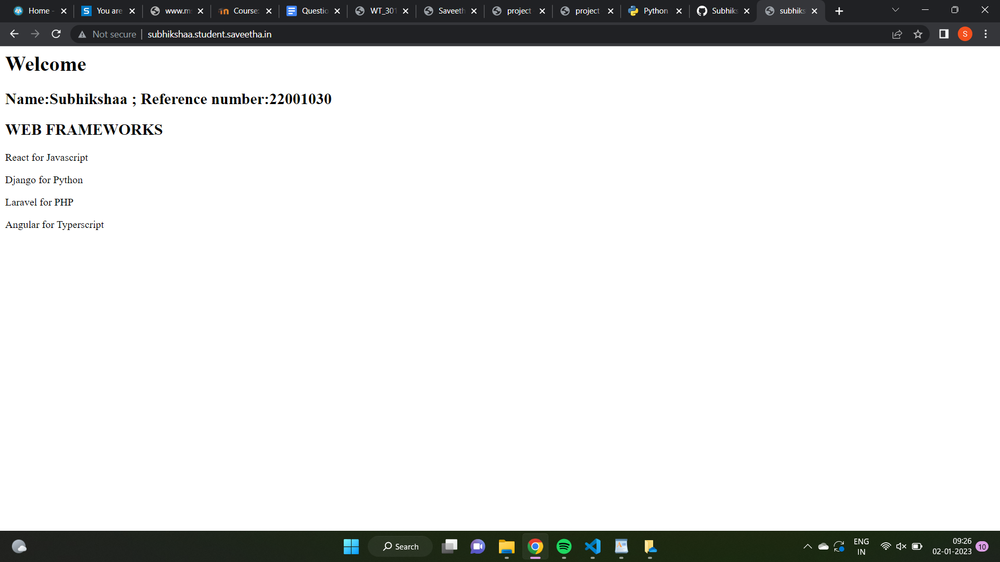

# Developing a Simple Webserver

# AIM:

Name: Subhikshaa M; Ref./Reg. No.: 22001030

# DESIGN STEPS:

## Step 1:

HTML content creation is done

## Step 2:

Design of webserver workflow

## Step 3:

Implementation using Python code

## Step 4:

Serving the HTML pages.

## Step 5:

Testing the webserver

# PROGRAM:
```
from http.server import HTTPServer,BaseHTTPRequestHandler

content = """
<html>
<head>
</head>
<body>
<h1>Welcome</h1>
<h2>WEB FRAMEWORKS</h2>
<p>React for Javascript</p>
<p>Django for Python</p>
<p>Laravel for PHP</p>
<p>Angular for Typerscript</p>
</body>
</html>
"""

class HelloHandler(BaseHTTPRequestHandler):
  def do_GET(self):
     self.send_response(200)
     self.send_header('Content-type','text/html;charset=utf-8')
     self.end_headers()
     self.wfile.write(content.encode())

server_address=('',80)
httpd=HTTPServer(server_address,HelloHandler)
httpd.serve_forever()
```
# OUTPUT:


# RESULT:

The program is executed succesfully
